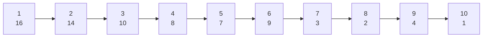
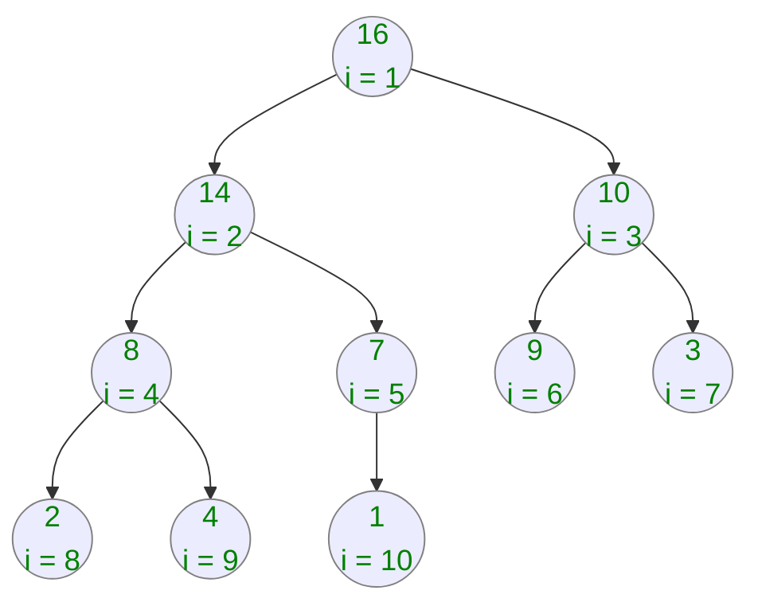

# Heap Sort & Heaps

### Definition
* Array A repesents a heap when:
```
# Given a array A containing elements A[1..A.lenght]
Heap has elements from A[1..A.heap_size] are valid, where 0 <= A.heap_size <= A.lenght
```
* The heap root is always A[1]
* Given a index i of heap node, we can compute the A indices using node parent, left and right childs. Applying the following operations
```
# Given i, the A indice of given heap node

PARENT(i) = mod(i/2)

LEFT(i) = 2i

RIGHT(i) = 2i + 1
```

### Max Heap properties
* The largest element in the heap lives into root node
* For each node into the heap, it's children elements has values less than the parent.

### Max Heap Sorting
* **Steps**:
  * 1. Create a max heap from array, swapping the values when max-heap properties are not correct.
    * Now the largest value from array is at the heap root.
  * 2. Go down from A.lenght swapping the root with the heap leafs and decrementing heap size until heap position 2.
    * While decrementing heap size, we need to ensure the heap properties are preserved. 

_Unsorted Array_


_Heap Structure_

